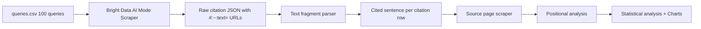

# Grounding Citation Analysis

> The dataset from this study is now maintained in the consolidated [ai-search-datasets](https://github.com/danishashko/ai-search-datasets/tree/main/grounding-citation-analysis) repo alongside newer studies. This repo keeps the full pipeline, notebooks, and charts.


**Reverse engineering Google AI Mode's sentence-level citation behaviour using `#:~:text=` URL fragments.**

[](https://python.org)
[](LICENSE)

---

## The Core Insight

Every Google AI Mode and Gemini citation URL contains a hidden [Web Text Fragment](https://web.dev/text-fragments/) anchor:

```
https://example.com/page#:~:text=Exact%20sentence%20Google%20cited%20here
```

Decode it and you know **exactly which sentence Google extracted** from the source page — no guesswork. This is the first reproducible study to exploit this at scale.

---

## What This Repo Does



1. **Collect** — Use Bright Data's Google AI Mode Scraper (real SERP, not API) to gather citation URLs for 100 queries
2. **Parse** — Decode `#:~:text=` fragments to extract the exact cited sentence from every citation URL
3. **Scrape** — Fetch source pages and locate each cited sentence within the document (positional analysis)
4. **Analyse** — Statistical tests for positional bias, sentence length preferences, structured content advantage, platform divergence
5. **Visualise** — Publication-quality charts for the accompanying article

---

## Quick Start

### Prerequisites

- Python 3.11+
- A [Bright Data](https://brightdata.com) account with API key
- ~$6–25 budget for data collection (1,000 queries + source pages ≈ $25 max)

### Setup

```bash
git clone https://github.com/yourusername/grounding-citation-analysis
cd grounding-citation-analysis

# Install dependencies
pip install -r requirements.txt

# Configure credentials
cp .env.example .env
# Edit .env and set: BRIGHTDATA_API_KEY=your_key_here
```

### Run the Full Pipeline

```bash
# Step 1: Collect AI Mode citations
python scripts/01_collect_ai_mode.py --limit 20  # start small to verify

# Step 2: (Optional) Collect Gemini citations
# Set BRIGHTDATA_GEMINI_DATASET_ID in .env first
python scripts/02_collect_gemini.py --limit 20

# Step 3: Parse #:~:text= fragments → citations.csv
python scripts/03_parse_text_fragments.py

# Step 4: Scrape source pages (positional analysis)
python scripts/04_scrape_source_pages.py --limit 100  # start small

# Step 5: Statistical analysis
python scripts/05_analyze_patterns.py

# Step 6: Generate charts
python scripts/06_generate_charts.py
```

---

## Project Structure

```
grounding-citation-analysis/
├── .env                          # Your Bright Data API key (not committed)
├── .gitignore
├── requirements.txt
├── README.md
│
├── queries/
│   └── queries.csv               # 100 queries across 12 categories
│
├── scripts/
│   ├── 01_collect_ai_mode.py     # Bright Data AI Mode Scraper trigger + poll
│   ├── 02_collect_gemini.py      # Bright Data Gemini Scraper trigger + poll
│   ├── 03_parse_text_fragments.py # #:~:text= URL decoder → citations.csv
│   ├── 04_scrape_source_pages.py  # Source page fetcher + positional analysis
│   ├── 05_analyze_patterns.py    # Statistical analysis (scipy)
│   └── 06_generate_charts.py     # Matplotlib/seaborn visualisations
│
├── data/
│   ├── raw/                      # Raw Bright Data JSON snapshots
│   ├── parsed/
│   │   ├── citations.csv         # One row per citation, includes cited_sentence
│   │   ├── answers.csv           # One row per query/answer
│   │   └── source_pages.csv      # Source page positional data
│   └── analysis/
│       ├── summary_stats.json
│       ├── positional_distribution.csv
│       ├── domain_frequency.csv
│       ├── platform_overlap.csv
│       └── category_breakdown.csv
│
├── notebooks/
│   ├── 01_methodology.ipynb
│   └── 02_findings.ipynb
│
├── reports/                      # Generated charts (PNG)
│
└── article/
    ├── article.md                # Full LinkedIn article
    └── diagrams/                 # Mermaid source files
```

---

## Key Data Schema

### `citations.csv` (primary output)

| Column | Description |
|--------|-------------|
| `platform` | `ai_mode` or `gemini` |
| `query` | The search query |
| `citation_url_raw` | Full URL including `#:~:text=` fragment |
| `citation_url_clean` | URL without fragment |
| `domain` | Cited domain |
| `has_text_fragment` | Boolean — does URL contain `#:~:text=`? |
| `cited_sentence` | **Decoded sentence Google cited** |
| `cited_sentence_word_count` | Word count of cited sentence |
| `fragment_raw` | Raw (URL-encoded) fragment |
| `cited_flag` | Boolean from Bright Data — marked as citation |

### `source_pages.csv` (after step 04)

| Column | Description |
|--------|-------------|
| `found` | Boolean — cited sentence located in page |
| `block_index` | Element index where sentence was found |
| `block_total` | Total elements in page |
| `relative_position` | `block_index / block_total` (0 = top, 1 = bottom) |
| `page_word_count` | Total word count of source page |
| `has_structured_content` | Page contains `<ul>`, `<ol>`, or `<table>` |

---

## Research Questions & Hypotheses

| # | Hypothesis | Test |
|---|-----------|------|
| H1 | Cited sentences cluster in the top 30% of documents | One-sample t-test, mean position < 0.5 |
| H2 | Cited sentences are shorter than average page text | Descriptive statistics, histogram |
| H3 | Structured pages (lists/tables) are cited more | Chi-square test |
| H4 | AI Mode and Gemini cite overlapping but distinct URLs | Jaccard similarity |
| H5 | Sentence length varies by query category | One-way ANOVA |

---

## Comparison to Prior Research

| Study | Sample | Granularity | Method | This Study's Advance |
|-------|--------|-------------|--------|----------------------|
| Ahrefs (2024) | 1.9M citations | Page level | Custom crawler | Sentence-level decoding |
| Surfer SEO (2024) | 46M citations | Domain level | API collection | Real SERP; positional data |
| Seer Interactive (2024) | Variable | Query level | Gemini API | Within-page position |
| DEJAN AI (2024) | Conceptual | Theoretical | Manual + LLM | Empirical validation |
| **This study** | 100+ queries | **Sentence level** | Bright Data + `#:~:text=` | — |

---

## Bright Data API Reference

**AI Mode Scraper**
- Dataset ID: `gd_mcswdt6z2elth3zqr2`
- Endpoint: `POST https://api.brightdata.com/datasets/v3/trigger?dataset_id=gd_mcswdt6z2elth3zqr2`
- Input: `[{"url": "https://www.google.com/search?udm=50", "prompt": "...", "country": "US"}]`
- Output includes `citations[].url` with `#:~:text=` fragments

**Why not the Gemini API?**
Surfer SEO's research found that the Gemini developer API returns different answers from the actual Google Search AI Mode SERP. Bright Data's scraper hits the real `google.com/search?udm=50` endpoint via residential proxies.

---

## Licence

MIT — see [LICENSE](LICENSE). Cite this repo if you use the methodology.

---

## Author

[Your Name] | [Your LinkedIn] | [Your Website]

*Accompanying article: [How Google Actually Chooses Which Sentences to Cite in AI Mode](article/article.md)*
