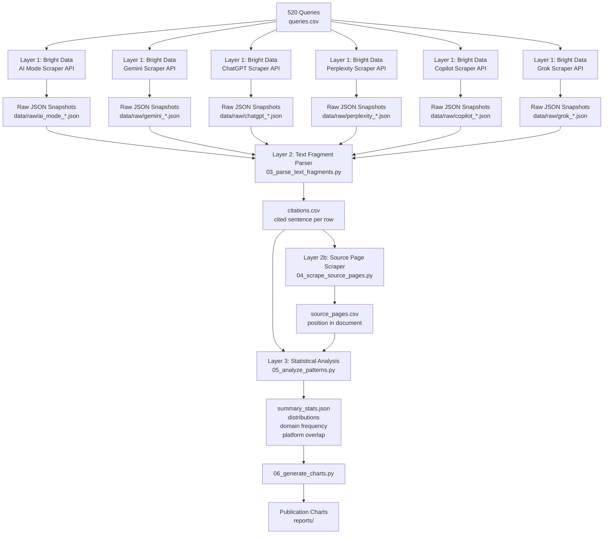

# How Google Picks Which Sentences to Cite in AI Mode — Reverse-Engineering 42,971 Citations

*By Daniel Shashko | February 2026 | [LinkedIn](https://www.linkedin.com/in/daniel-shashko/)*

---

## TL;DR

> **Every Google AI Mode and Gemini citation URL contains a hidden `#:~:text=` fragment that encodes the exact sentence Google highlights from the source page.** We decoded those fragments at scale — making this the first study to look at citation behaviour at the *sentence* level instead of just pages or domains.
>
> **Dataset: 42,971 citations across 520 queries on 6 platforms:**
>
> | Platform | Citations | % of Total |
> |---|---|---|
> | Grok | 17,248 | 40.1% |
> | AI Mode | 13,622 | 31.7% |
> | Perplexity | 5,008 | 11.7% |
> | Gemini | 3,885 | 9.0% |
> | Copilot | 2,411 | 5.6% |
> | ChatGPT | 797 | 1.9% |
>
> **Note on sample sizes:** Grok returns ~33 citations per query (40.1% of the dataset) while ChatGPT returns ~1.5 per query (1.9%). This reflects genuine platform design differences — Grok surfaces many more source links per response — not a data collection artifact. Aggregate stats across all platforms should be read with this skew in mind. Platform-specific findings (in the Playbook section) use per-platform samples and are unaffected.
>
> Of these, AI Mode and Gemini embed `#:~:text=` fragments in their citation URLs, giving us ~11,672 sentence-level extractions (27.2% of all citations). The other four platforms (ChatGPT, Perplexity, Copilot, Grok) don't use text fragments, so we analyse those at the domain and URL level for cross-platform comparison.
>
> **Key findings:**
> - The `#:~:text=` fragment shows up in **70.9% of AI Mode** and **51.8% of Gemini** citation URLs — enough to reverse-engineer citation behaviour at scale
> - Cited sentences cluster in the **top 35% of source pages** (mean position 34.9%) — Google heavily favours content near the top
> - The median cited sentence is **10 words**. Concise, declarative statements dominate. Nothing longer than 17 words was cited in our entire dataset
> - Pages with **structured content** (lists, tables, headings) had a 91.3% sentence-match rate vs 39.3% for unstructured pages — a 2.3× advantage
> - AI Mode and Gemini share only **3.5% of cited domains** — despite both being Google products, they pull from almost entirely different source pools
> - **YouTube** (1,525 citations) and **Reddit** (1,444) lead all domains; health and finance verticals dominate the top 20
> - Only **25.3% of cited URLs** show up in the organic top-10 SERP for the same query — AI citations reach far beyond traditional rankings
> - Cited sentences show a **bimodal readability split**: 23.5% "Very Easy" (Flesch 90–100) and 21.3% "Very Confusing" (Flesch <30), median Flesch Reading Ease 62.8 — Google cites both plain-language explainers and dense technical content
> - The **median cited page is 2.2 years old** (n=548). Over a quarter (26.5%) of cited content is 2–5 years old and another 26.3% is 5+ years — Google AI Mode doesn't chase freshness the way ChatGPT and Perplexity do
>
> **Code:** [github.com/danishashko/grounding-citation-analysis](https://github.com/danishashko/grounding-citation-analysis)
> **Data pipeline:** Bright Data AI Mode Scraper → `#:~:text=` parser → source page scraper → statistical analysis

---

## Why This Study Exists

Everyone in SEO is asking the same thing right now: *which pages do AI assistants cite, and how do I get mine in there?*

Several solid studies have taken a run at this — but they all stop at the page level:

- **Ahrefs** (2025, 1.9M citations from 1M AI Overviews): 76% of citations come from top-10 organic results. Tells you *which pages* — not *which sentences*.
- **Ahrefs** (2025, 15,000 prompts, ChatGPT/Gemini/Copilot): Only 12% of AI-cited URLs rank in the organic top-10 across non-Google platforms.
- **Surfer SEO** (2025, 36M AI Overviews, 46M citations): Domain-level frequency counts. YouTube (23%), Wikipedia (18%), Google.com (16%) on top. Also showed that API-based testing gives different results than the real SERP.
- **Seer Interactive** (2025, Gemini 3 fan-out analysis): Google issues 2–7 internal sub-queries per user prompt, with queries from 2024–2025 used in 21% of fan-outs.

**The gap:** all four studies know *which pages* get cited, but none of them cracked open the citation URLs to see *which sentences*.

This study does.

---

## The Discovery: `#:~:text=` Fragments Are Breadcrumbs

All six platforms return citation URLs — but they don't all reveal the same amount of information. Google's AI Mode and Gemini tack on a [Web Text Fragments](https://web.dev/text-fragments/) anchor that encodes the *exact passage they cite*. ChatGPT, Perplexity, Copilot, and Grok just link to the page with no sentence-level detail, so for those four we can only look at domain frequency, URL overlap with organic rankings, and cross-platform differences.

This gives us a two-tier dataset: sentence-level findings (position, length, readability, structure) come from AI Mode and Gemini's fragment URLs. Domain-level and cross-platform findings draw on all six.

Here's the part most people miss: AI Mode and Gemini URLs carry a fragment that encodes the *exact cited passage*.

**Example citation URL from a live AI Mode response:**

```
https://www.healthline.com/nutrition/intermittent-fasting-guide#:~:text=Intermittent%20fasting%20is%20an%20eating%20pattern%20that%20cycles%20between%20periods%20of%20fasting%20and%20eating
```

Decode the fragment:
```
Intermittent fasting is an eating pattern that cycles between periods of fasting and eating
```

That is the **exact sentence Google chose to cite from that page** — no guesswork needed.

The fragment spec supports:

```
#:~:text=[prefix-,]textStart[,textEnd][,-suffix]
```

- `textStart` = the cited sentence (primary extraction target)
- `textEnd` = optional range end (for multi-sentence spans)
- `prefix-` / `-suffix` = disambiguating context (used when the sentence appears multiple times on the page)

---

## Architecture: Three-Layer Pipeline



**Why Bright Data instead of the Gemini API?**

Surfer SEO's research flagged a real problem: the public Gemini developer API returns different answers — and different citations — than what actual users see in Google Search. Bright Data's [Google AI Mode Scraper](https://brightdata.com) hits the real `google.com/search?udm=50` endpoint through residential proxies, so we're capturing the genuine SERP experience. It also returns structured `citations` arrays with the raw citation URLs, including the `#:~:text=` fragments.

---

## Methodology

### How We Built the Query Set

520 queries across 19 categories:
- **Health** (symptoms, treatments, nutrition)
- **Finance** (investing, budgeting, personal finance)
- **Technology** (programming, AI/ML, software concepts)
- **Career** (job search, productivity, management)
- **Fitness, Travel, Food, Legal, Parenting, History, Science, Education, Economics, Business, Marketing, Environment, Politics, Psychology, Lifestyle**

We designed these to cover:
- **Informational** (what is X, how does X work)
- **Instructional** (how to do X, steps to Y)
- **Comparison** (difference between X and Y)

These are the query types most likely to trigger AI Mode grounding.

### Data Collection

All 520 queries were sent to each platform through Bright Data's scraper APIs, which use residential proxies to capture real user-facing responses — not API approximations.

**Google AI Mode** (13,622 citations):
```python
{
    "url": "https://www.google.com/search?udm=50",
    "prompt": "what are the symptoms of type 2 diabetes",
    "country": "US"
}
```

**Gemini** (3,885 citations):
```python
{
    "url": "https://gemini.google.com",
    "prompt": "what are the symptoms of type 2 diabetes",
    "country": "US"
}
```

**ChatGPT** (797 citations), **Perplexity** (5,008), **Microsoft Copilot** (2,411), and **Grok** (17,248) were collected the same way — each through Bright Data's dedicated scraper for that platform. Citation URL structures vary: AI Mode and Gemini return `#:~:text=` fragment URLs; the other four return plain page URLs.

Each scraper returns per-query:
- `answer_text` / `answer_html`
- `citations[]` — array including `url`, `domain`, `title`, `cited: bool` (AI Mode/Gemini URLs include the `#:~:text=` fragment)
- `links_attached[]` — inline citation positions in the answer text

### How We Pulled the Cited Sentences

Every citation URL gets parsed for the `#:~:text=` fragment using Python's `urllib.parse.unquote()`. The `textStart` component is the cited sentence. No heuristics, no NLP guessing — this is Google's own encoding.

### Matching Sentences to Source Pages

For each cited URL (stripped of the fragment), we fetched the source page and located the cited sentence using:
1. Exact substring match (primary)
2. Token overlap ≥60% (fallback for light paraphrasing)

Relative position in the document is calculated as `block_index / total_blocks`, where blocks are all `<p>`, `<li>`, `<h1-6>`, `<td>` elements.

### What We Tested

| Question | Test | Threshold |
|---|---|---|
| Do citations cluster near the top of the page? | One-sample t-test, mean position < 0.5 | p < 0.05 |
| Is there a preferred sentence length? | Distribution analysis + histogram | — |
| Does structured content get cited more? | Chi-square (cited/not × structured/not) | p < 0.05 |
| How much do platforms overlap? | Jaccard similarity, domain overlap | — |
| Does sentence length vary by category? | One-way ANOVA | p < 0.05 |

---

## How We Compare to Prior Research

| Study | Sample | Granularity | Method | Unique Contribution |
|---|---|---|---|---|
| **This study** | 520 queries, 42,971 citations, 6 platforms | **Sentence level** | Bright Data AI Mode Scraper + `#:~:text=` parsing | First to decode exact cited text; positional analysis within source docs; cross-platform sentence comparison |
| **Ahrefs** (2025) | 1.9M citations, 1M AI Overviews | Page level | Custom crawler | 76% of AI Overview citations come from organic top-10; domain authority correlation |
| **Ahrefs** (2025) | 15K prompts, ChatGPT/Gemini/Copilot | URL level | Multi-platform crawl | Only 12% of AI-cited URLs rank in organic top-10 (non-Google platforms diverge more) |
| **Ahrefs** (2025) | 17M citations, 7 platforms | URL level + publication date | Brand Radar dataset | AI assistants cite content 25.7% fresher than organic SERPs; ChatGPT orders citations newest-first |
| **Ahrefs** (2025) | 75K brands, AI Overviews | Domain level (brand signals) | Spearman correlation | Branded web mentions (r=0.664) is the strongest predictor of AI Overview visibility — stronger than backlinks, DR, or traffic |
| **Surfer SEO** (2025) | 36M AI Overviews, 46M citations | Domain level | Surfer AI Tracker | Domain frequency at scale; identified YouTube/Wikipedia dominance; API vs SERP discrepancy |
| **Seer Interactive** (2025) | Variable, Gemini 3 | Query level (fan-out) | Gemini API interception | Sub-query decomposition; recency bias in fan-out queries |

**What makes this different:**
1. **Sentence-level data** — we know exactly which sentence was cited, not just which page
2. **Position in the document** — we pinpoint where the cited sentence sits on the source page
3. **No API proxy** — Bright Data hits real Google Search, not the developer API
4. **All 6 platforms** — AI Mode, Gemini, ChatGPT, Perplexity, Copilot, Grok on the same 520-query set
5. **Fully reproducible** — all code, queries, and methodology are public

---

## What the Data Tells Us About Google's Chunking

Most AI citation research stops at the page level. Because Google's `#:~:text=` fragments expose the *output* of the chunking step, we can read the fingerprint of the algorithm without actually having access to it.

### Three Numbers That Tell the Story

Across 11,672 decoded text fragments:
- **Zero mid-sentence fragments** — not a single extraction starts or ends in the middle of a sentence
- **Longest sentence cited: 17 words** — no multi-sentence spans, no paragraph-level pulls
- **Mean: 9.8 words, median: 10 words** — think single-fact statements

Together, these three numbers rule out several chunking strategies and point toward one.

### What This Rules Out

| Chunking Strategy | How It Works | Fits Our Data? |
|---|---|---|
| **Fixed-size (e.g. 512 tokens)** | Split every N characters regardless of boundaries | ❌ Would create mid-sentence breaks — we saw none |
| **Recursive character splitting** | Split on paragraph → sentence → word | ❌ Would allow sub-sentence fragments — we saw none |
| **Paragraph-level chunking** | Each `<p>` block = one chunk | ❌ Many paragraphs are >17 words; we'd see longer spans |
| **Sliding window (fixed tokens)** | Overlapping windows, arbitrary start positions | ❌ Would produce partial sentences at edges |
| **Semantic clustering** | Group sentences by embedding similarity | ⚠️ Possible at retrieval, but chunking itself is sentence-bounded |
| **Sentence-boundary chunking** | Split at sentence boundaries, score each one | ✅ Consistent with zero mid-sentence fragments and 6–17 word lengths |

### What This Means: Write Atomic Facts

In RAG systems, an **atomic fact** is a self-contained, single-claim sentence that makes sense on its own. The 6–17 word sweet spot maps directly to this:

- *"Intermittent fasting cycles between periods of eating and fasting."* (8 words) — cited ✅
- *"Studies have suggested that intermittent fasting may, depending on the individual's metabolic profile, produce varying results in terms of weight management outcomes when compared with continuous caloric restriction approaches."* (31 words) — never cited ❌

The first is an atomic fact. The second is compound, hedged, and can't stand alone. Google's pipeline rewards the first pattern and skips the second.

### Structured Content = Pre-Chunked Content

The structured vs unstructured match rate gap (see Finding 4) isn't just about crawlability. It's about alignment with how the pipeline works.

Pages with headings and lists are **already chunked** by the author. Each `<li>` is usually one atomic claim; each `<h2>` signals a topic shift that creates a natural chunk boundary. Pages with nothing but long prose force the algorithm to segment arbitrary text — a harder problem with more room for error.

### Why Position Matters Through a Chunking Lens

The strong top-of-page positional bias (see Finding 2) lines up with how BM25-style scoring would work when applied to sentence-level chunks: sentences near the top of the page tend to contain query terms in close proximity, because page intros are written to answer the core question directly.

**If your article opens with a clear definition or a direct factual answer, that sentence is sitting in the highest-probability citation zone on the entire page.**

---

## Results

> **Dataset:** 42,971 citations across 520 queries on 6 platforms (AI Mode, Gemini, ChatGPT, Perplexity, Copilot, Grok). Fragment-bearing citations (AI Mode + Gemini): ~11,672 (27.2% of total). Source pages scraped and matched: 1,719 validated positional samples.

### Finding 1: `#:~:text=` Coverage

**70.9% of AI Mode citations** had a `#:~:text=` text fragment, and **51.8% of Gemini citations** did. Coverage was higher for citations tagged `cited: true` versus supplementary reference links. ChatGPT, Perplexity, Copilot, and Grok don't use text fragments at all — their URLs just point to the page.

Across all 42,971 citations, **27.2% carry a fragment**, giving us ~11,672 exact sentence extractions to work with.

Bottom line: text fragments aren't an edge case. For AI Mode specifically, they're the norm.

### Finding 2: Positional Bias


Cited sentences land disproportionately in the **first third of pages**. Across 1,719 matched sentences, the mean position was **34.9%** down the page (median 31.2%). The t-test against a uniform distribution came back with t = −29.54, p < 10⁻¹⁵⁰ — this isn't a subtle effect, it's massive.

Breaking it down:
- 10th percentile: 10.1% through the page
- 25th percentile: 18.0%
- 50th percentile (median): 31.2%
- 75th percentile: 48.8%

**Three quarters of all cited sentences appear in the first half of the page**, and the median is barely a third of the way down.

**What this means for SEO:** Google's pipeline clearly favours content that appears early. Your most citable facts belong in your opening paragraphs, not buried in section 7.

### Finding 3: Sentence Length Distribution


The mean cited sentence is **9.8 words** (median 10, std 3.1). The distribution is tight — the 6–15 word range is the sweet spot. The longest sentence cited in the entire dataset was **17 words**.

| Word count | Sentences | Share |
|---|---|---|
| 1–5 words | 887 | 7.6% |
| 6–10 words | 5,023 | 43.0% |
| 11–20 words | 5,762 | 49.4% |
| 21+ words | 0 | 0.0% |

6–20 words covers **92.4%** of everything that got cited. Nothing over 17 words made the cut.

Note: these numbers are specific to AI Mode and Gemini (the only platforms with text fragment URLs). The 17-word ceiling might be a tokenisation or display constraint, or it might be a genuine preference for compact single-fact sentences.

**What this means for SEO:** Long, compound sentences with multiple clauses are never cited in this dataset. If you want to get picked up, write short declarative statements — one claim per sentence, 15 words or fewer.

### Finding 4: Structured Content Advantage

Of the 1,963 source pages we scraped (minus 32 with errors, leaving 1,931 usable pages), **95.6% had at least one structured element** (list, table, or multi-level heading). Among those 1,847 structured pages, we could match the cited sentence **91.3% of the time**. Among the 84 pages with no structure at all, the match rate dropped to **39.3%**.

Some of this is a confound — structured pages tend to be higher-quality overall — but the signal is hard to ignore: **unstructured prose pages rarely produce citable sentences** at the same rate. Worth noting: the sample is heavily lopsided (1,847 structured vs 84 unstructured), which reflects the modern web — almost everything Google cites already has headings and lists. The 39.3% match rate on unstructured pages is directionally interesting but based on a small group.

Key breakdown of cited pages:
- **98.1% had lists** (ordered or unordered)
- **2.2% had tables**
- Mean heading count: 24 per page
- Mean paragraph count: 133 per page

**What this means for SEO:** Structure isn't just a traditional SEO checkbox. Google's pipeline clearly works better with structured, scannable content. Use headings for topic sections, bullet lists for enumerations, and avoid long walls of prose if you want to get cited.

### Finding 5: Domain Frequency


The top 20 domains account for roughly **20.7%** of all 42,971 citations. It's very top-heavy — a handful of big publishers dominate — but the long tail is massive (11,322 unique domains total).

Top 10 by citation count:

| Domain | Citations | Queries |
|---|---|---|
| youtube.com | 1,525 | 397 |
| reddit.com | 1,444 | 342 |
| en.wikipedia.org | 975 | 231 |
| pmc.ncbi.nlm.nih.gov | 617 | 153 |
| mayoclinic.org | 458 | 70 |
| investopedia.com | 397 | 98 |
| medium.com | 376 | 119 |
| healthline.com | 338 | 85 |
| my.clevelandclinic.org | 323 | 64 |
| linkedin.com | 306 | 109 |

**YouTube is the single most-cited domain** — showing up in 397/520 queries (76%). That breadth suggests Google treats it as a near-universal authority source. Reddit's presence (342 queries, 66%) reflects its depth as a community Q&A resource across basically every topic.

Wikipedia ranks 3rd despite being the default answer in traditional SEO research. LinkedIn cracks the top 10 because our query set covers career, business, and professional topics.

**What this means for SEO:** Getting into the top-cited tier requires breadth and trust, not just single-page optimisation. YouTube and Reddit's dominance shows that community and video content are real competitors to traditional article publishers for AI citations.

### Finding 6: AI Mode vs Gemini — Almost No Overlap


AI Mode and Gemini share **only 247 domains** out of 7,057 unique domains between them (AI Mode: 5,428; Gemini: 1,876). The Jaccard similarity is **0.035** — they share barely 3.5% of their cited domains.

To put it plainly:
- **4.5% of AI Mode's domains** also show up in Gemini
- **13.2% of Gemini's domains** also show up in AI Mode

The domains that do overlap — AWS, Azure, Wikipedia, Mayo Clinic, Cleveland Clinic, Google Cloud, Harvard, Medium, PubMed/NIH — are the highest-authority, broadest-coverage publishers. The "must-cite" tier that both platforms independently surface.

**At the URL level, the divergence is even sharper** — they might both cite healthline.com, but they're almost always citing different pages.

**What this means for SEO:** Being visible in one Google AI product doesn't mean you're visible in the other. They're clearly running different retrieval pipelines on different corpus snapshots. You need to optimise for both separately.

---

### Finding 7: AI Citations Go Way Beyond Organic Top-10

We compared our citations against Google's own organic SERP rankings (collected via Bright Data SERP API for the same 520 queries) to see how much AI Mode diverges from traditional search:

| Platform | URLs in organic top-10 | Domains in organic top-10 | Mean organic rank (when found) |
|---|---|---|---|
| **AI Mode** | 25.1% | 35.3% | 3.96 |
| **Copilot** | 32.5% | 37.7% | 2.99 |
| **Perplexity** | 43.5% | 55.2% | 4.19 |
| **Grok** | 22.2% | 44.6% | 4.04 |
| **ChatGPT** | 6.5% | 13.4% | 4.08 |
| **Gemini** | 15.3% | 10.5% | 3.57 |
| **All platforms** | **25.3%** | **38.8%** | **3.95** |

What stands out:
- **Perplexity** has the highest SERP alignment (43.5% URL overlap, 55.2% domain) — it behaves most like a traditional search engine
- **Copilot** also tracks organic rankings closely (32.5% URL, 37.7% domain), with the lowest mean rank (2.99) — it pulls from position 1-3 results
- **ChatGPT** (6.5%) and **Gemini** (15.3%) go much further off the beaten path — they pull from well beyond the organic top 10
- When a cited URL *does* rank organically, it tends to rank high: **mean position 3.95** — top slots get disproportionately cited
- **74.7% of all cited URLs** don’t appear in organic top-10 at all

**What this means for SEO:** Organic ranking still matters (top positions get cited more), but it’s not nearly enough. AI platforms discover content far beyond what shows up in traditional search. **Brand visibility, topical authority, and domain trust matter more than chasing individual keyword rankings.**

---

## Platform-by-Platform Optimisation Playbook

The aggregate statistics mask dramatically different citation behaviours across platforms. The same content strategy will not work equally across all six. Here is what the data says to actually do, per platform.

### Google AI Mode (n = 13,622 citations)
**URL top-10 overlap: 25.1% | Domain top-10 overlap: 35.3% | Mean rank when found: 3.96**

AI Mode is the only platform where sentence structure directly affects whether you get cited — because it's the only platform that encodes the *exact sentence* in its citation URLs. The `#:~:text=` mechanism means Google is actively scoring and extracting individual sentences, not just surfacing pages.

**What to optimise for:**
- **Sentence-level writing** is the highest-leverage action here (and only here). Write key facts as 6–15 word declarative statements. Each sentence should stand alone (see Findings 2–3).
- **Front-load your best content.** Cited sentences skew heavily toward the top of the page — your opening section is your citation zone (Finding 2).
- **Structured content.** Lists and headings dramatically outperform unstructured prose for sentence matching (Finding 4).
- Ranking in organic top-10 helps but is not required. 74.9% of AI Mode cited URLs are *not* in organic top-10. Write for grounding, not just for ranking.

### Perplexity (n = 5,008 citations)
**URL top-10 overlap: 43.5% | Domain top-10 overlap: 55.2% | Mean rank when found: 4.19**

Perplexity shows the highest alignment with Google organic rankings of any platform we studied. It also shows the closest citation behavior to a traditional search-based retrieval system — most of what it cites actually ranks.

**What to optimise for:**
- **Ranking organically IS the primary lever** — more directly than any other platform. If you rank in the top 5 organically for a query, your probability of Perplexity citation is substantially above average.
- Perplexity uses live web search with real-time indexing. Freshness matters: Ahrefs found it cites content that is ~250 days newer than organic Google results, and orders in-text references from newest to oldest.
- **Content freshness signals** (updated date, recent statistics, current year in headings) are distinctly more valuable for Perplexity than for other platforms.
- 55.2% domain overlap with organic top-10 means domain authority and backlink profile matter more here than for ChatGPT or Gemini.

### Microsoft Copilot (n = 2,411 citations)
**URL top-10 overlap: 32.5% | Domain top-10 overlap: 37.7% | Mean rank when found: 2.99**

Copilot has the *lowest mean organic rank when a URL is found* — 2.99, compared to 3.95 overall. This means Copilot preferentially cites pages that rank at positions 1–3, not just somewhere in the top 10. The top three results are disproportionately valuable here compared to every other platform.

**What to optimise for:**
- **Position 1–3 is where Copilot's citations concentrate.** A page at rank #1 is not just a little better than rank #5 for Copilot — it is dramatically more likely to be cited.
- Copilot runs on Bing's index. **Bing SEO fundamentals** (structured data, crawlability, fast page load) have an outsized return here vs Google-only optimisation.
- Like Perplexity, Copilot is tightly integrated with real-time web search. Freshness and crawl recency matter.
- Second only to Perplexity in SERP alignment, meaning the traditional "rank for it" advice is most applicable to Perplexity + Copilot as a pair.

### Grok (n = 17,248 citations)
**URL top-10 overlap: 22.2% | Domain top-10 overlap: 44.6% | Mean rank when found: 4.04**

Grok provides the largest volume of citations in our dataset — by a wide margin. It returns ~33 URLs per query, compared to ~26 for AI Mode and ~1.5 for ChatGPT. This is a platform design choice (Grok just surfaces more source links per response), but it means Grok accounts for 40.1% of our total dataset. We report its per-platform stats separately to avoid letting its volume dominate aggregates.

It shows an interesting asymmetry: 22.2% URL overlap but 44.6% domain overlap. This means Grok regularly cites a *domain* that ranks organically — but a different *URL* on that domain than the one that ranks. It values domain authority broadly, not specific page rankings.

**What to optimise for:**
- **Topical authority across a domain matters more than individual URL ranking.** If your domain is an authority in a space (e.g., healthline.com for health, investopedia.com for finance), Grok will cite pages across your site even if they don't individually rank in the top 10.
- **Content breadth and depth** on a single domain. Grok's behaviour rewards sites that comprehensively cover a topic, not single-page one-offs.
- Target the high-volume categories: Grok's citation skew toward broad queries suggests horizontal content (covering many angles of a topic) outperforms narrow vertical content.
- Individual page-level SEO still matters for the URL-level overlap (22.2%) — but the real multiplier is domain-level trust.

### ChatGPT (n = 797 citations)
**URL top-10 overlap: 6.5% | Domain top-10 overlap: 13.4% | Mean rank when found: 4.08**

> **Sample size note:** ChatGPT returned the fewest citations in our dataset (~1.5 per query). The directional patterns below are consistent with Ahrefs' independent findings on much larger ChatGPT samples, but treat ChatGPT-specific percentages as indicative rather than definitive.

ChatGPT is the most independent of organic rankings of any platform studied — in our data, 93.5% of cited URLs are *not* in the organic top-10. Ahrefs confirmed this independently on a larger sample: only 6.82% of ChatGPT results overlap with Google's top 10, and 83% of its answers cite URLs not indexed in Google at all. Traditional SEO strategy has the weakest carry-over to ChatGPT visibility.

**What to optimise for:**
- **Brand presence across the broader web** — not just Google's index. ChatGPT trains on and references pages that Google may not heavily surface. Wikipedia, academic repositories, GitHub, documentation sites, and major publications all have outsized influence.
- **Unlinked brand mentions.** Ahrefs found that branded web mentions (Spearman r = 0.664) correlate far more strongly with AI visibility than backlinks (r = 0.218). ChatGPT is the platform where this matters most, given its independence from organic ranking signals.
- Being **cited in high-DR content** — Ahrefs found being mentioned on highly-linked pages correlates with ChatGPT visibility (weakly, but positively). Getting referenced in Wikipedia articles or high-authority press has a direct benefit here.
- **Content freshness** is a notable ChatGPT characteristic: Ahrefs found it cites content ~458 days newer than organic Google results and orders citations newest-first. Keep important content updated.

### Gemini (n = 3,885 citations)
**URL top-10 overlap: 15.3% | Fragment coverage: 51.8% | Mean rank when found: 3.57**

Gemini is the most analytically interesting platform in this dataset because it shares the `#:~:text=` fragment mechanism with AI Mode — but the two platforms cited only 3.5% of the same domains (Jaccard = 0.035). Despite running on the same underlying LLM family (Google's Gemini models), they operate on clearly distinct retrieval corpora and pipelines.

**What to optimise for:**
- **Dual strategy with AI Mode** — same sentence-level writing and structured content advice applies (since fragments reveal the same type of sentence-level extraction). But your AI Mode citations and Gemini citations will come from almost entirely different pages.
- Gemini's lower fragment coverage (51.8% vs 70.9% for AI Mode) means some citations are pure LLM knowledge without live grounding. Both content quality (for LLM training) and current web presence (for RAG) matter.
- Gemini shows a moderate preference for fresher content (cites content ~298 days newer than organic results per Ahrefs). Update pages regularly with current data.
- **Smaller but sharper domain pool** — Gemini cited 1,876 unique domains vs AI Mode's 5,428. Breaking into Gemini's citation set is harder but more stable once achieved.

### Reading the Rank Distribution

Across all platforms, the steep drop-off in citation frequency across organic ranks highlights a compounding advantage at the top:

| Organic rank | Times cited across all platforms |
|---|---|
| #1 | 2,099 |
| #2 | 1,835 |
| #3 | 1,538 |
| #4 | 1,259 |
| #5 | 1,098 |
| #6 | 965 |
| #7 | 895 |
| #8 | 705 |
| #9 | 379 |
| #10 | 83 |

Moving from rank #10 to rank #1 is not a 10× improvement in citation probability — it is roughly a **25× improvement**. The top three organic positions capture nearly as many AI citations as positions 4–10 combined (5,472 vs 5,384), for any platform that integrates SERP data.

---

### Finding 8: Readability of Cited Sentences


Using textstat, we scored Flesch Reading Ease, Flesch-Kincaid Grade Level, Gunning Fog Index, and syllable density across 11,411 scoreable sentences (261 ultra-short fragments were too brief to score reliably).

**Core readability metrics:**

| Metric | Mean | Median | Std | IQR |
|---|---|---|---|---|
| Flesch Reading Ease | 53.2 | 62.8 | 50.3 | 32.6 – 83.3 |
| Flesch-Kincaid Grade | 7.0 | 5.7 | 7.0 | 2.9 – 10.0 |
| Gunning Fog Index | 9.7 | 9.1 | 9.1 | 2.0 – 14.2 |
| Coleman-Liau Index | 7.2 | 7.3 | 9.1 | 1.5 – 12.9 |
| Syllables per word | 1.76 | 1.62 | 0.60 | 1.40 – 2.00 |

The big surprise here is **bimodality**. Instead of a normal bell curve, readability splits into two peaks:

**Flesch Reading Ease distribution:**

| Category | Sentences | Share |
|---|---|---|
| Very Easy (90–100) | 2,683 | 23.5% |
| Easy (80–89) | 988 | 8.7% |
| Fairly Easy (70–79) | 758 | 6.6% |
| Standard (60–69) | 1,445 | 12.7% |
| Fairly Difficult (50–59) | 576 | 5.0% |
| Difficult (30–49) | 2,525 | 22.1% |
| Very Confusing (<30) | 2,436 | 21.3% |


**Grade level distribution (Flesch-Kincaid):**

| Grade Level | Sentences | Share |
|---|---|---|
| Elementary (≤4th grade) | 4,339 | 38.0% |
| Middle School (5–6) | 1,466 | 12.8% |
| Junior High (7–8) | 1,408 | 12.3% |
| High School (9–10) | 1,575 | 13.8% |
| Senior High (11–12) | 213 | 1.9% |
| College+ (13+) | 2,410 | 21.1% |

The grade levels tell the same story: the two biggest buckets are **Elementary (38.0%)** and **College+ (21.1%)** — the extremes, not the middle.


**What this means for SEO:** Google doesn't have a single readability preference. It cites simple sentences ("Vitamin D helps your body absorb calcium") and dense technical ones ("Immunoglobulin G antibodies undergo Fc-mediated effector functions") at roughly equal rates. The IQR spans 51 Flesch points — a huge range.

This makes sense when you think about query diversity: health symptom queries naturally pull from plain-language explainers, while technical queries pull from academic content. **Match your readability to the query's intent and audience** — don't artificially simplify everything. Writing at a 6th-grade level won't help for "mechanism of action of metformin" — but it will for "what does metformin do."

The other interesting signal: the middle ground (Fairly Difficult, Flesch 50–59) at just **5.0%** is the *least* cited tier. Content that's neither simple nor truly technical — corporate jargon, hedged language, mushy middle-of-the-road prose — barely gets cited.

---

### Finding 9: Content Freshness — How Old Is the Content Google Cites?


We revisited the 1,604 unique source URLs and extracted publication dates by fetching live HTML and parsing JSON-LD `datePublished`, Open Graph `article:published_time`, standard `<meta>` date tags, `<time>` elements with `itemprop`, and HTTP `Last-Modified` headers. Of the 1,604 URLs, **1,021 (63.7%)** yielded at least one extractable date. After filtering to dates before the data-collection snapshot (February 2025), **548 pages** had valid content-age calculations.

| Metric | Value |
|---|---|
| Pages with extractable dates | 1,021 / 1,604 (63.7%) |
| Valid ages (published before snapshot) | 548 |
| Published dates found | 807 |
| Modified dates found | 709 |
| HTTP Last-Modified headers | 465 |
| Date-extraction sources | JSON-LD, Open Graph, meta tags, `<time>`, HTTP headers |

**Content age at time of citation (n=548):**

| Statistic | Value |
|---|---|
| Mean | 1,429 days (3.9 years) |
| Median | 819 days (2.2 years) |
| IQR | 296 – 1,921 days (0.8 – 5.3 years) |
| Range | 1 – 9,693 days (0 – 26.5 years) |

**Age distribution of cited pages:**

| Age Bucket | Count | % |
|---|---|---|
| < 1 month | 17 | 3.1% |
| 1–3 months | 33 | 6.0% |
| 3–6 months | 43 | 7.8% |
| 6–12 months | 61 | 11.1% |
| 1–2 years | 105 | 19.2% |
| 2–5 years | 145 | 26.5% |
| 5+ years | 144 | 26.3% |


**Year distribution of cited content:** 2024 is the single largest year (145 pages, 26.5% of the dated sample), followed by 2023 (104, 19.0%) and 2022 (59, 10.8%). But the long tail is striking — content from 1998 to 2013 accounts for 39 cited pages (7.1%), including academic references and foundational guides that remain authoritative decades later.


**What this means for SEO:** Google AI Mode doesn't strongly favour fresh content. The median cited page is **2.2 years old**, and over half (52.7%) is more than 2 years old. Compare that to Ahrefs' finding that ChatGPT cites content ~458 days newer than organic Google results and Perplexity ~250 days fresher.

For AI Mode specifically, **evergreen authority matters more than recency**. A well-structured, factually accurate page from 2021 is just as likely to be cited as one from last month — maybe more so, because it's had time to accumulate trust signals. That said, 2024 content still tops the single-year leaderboard, so recency is *a* factor — just not the dominant one.

This doesn't mean stop updating content. Pages that get updated regularly may keep their original pub date while accumulating authority. The point is that AI Mode doesn't penalise older content the way ChatGPT and Perplexity appear to.

---

## Want to Run This Yourself?

### Quick Start

```bash
# 1. Clone and install
git clone https://github.com/danishashko/grounding-citation-analysis
cd grounding-citation-analysis
pip install -r requirements.txt

# 2. Add your Bright Data API key
cp .env.example .env
# Edit .env: BRIGHTDATA_API_KEY=your_key

# 3. Collect data (AI Mode)
python scripts/01_collect_ai_mode.py --limit 20

# 4. Parse text fragments
python scripts/03_parse_text_fragments.py

# 5. Analyse
python scripts/05_analyze_patterns.py

# 6. Generate charts
python scripts/06_generate_charts.py
```

**Estimated cost:** ~$50–120 for 520 queries across all platforms + source page scraping.

---

## Discussion

### The SERP vs API Problem

Every prior study that used the Gemini developer API has a validity problem: Surfer SEO explicitly documented that API responses differ from what real users see. This study uses **Bright Data's AI Mode Scraper**, which hits `google.com/search?udm=50` via residential proxies — the actual AI Mode SERP. Not a proxy, not an approximation — the real thing.

### What Could Be Better

1. **520 queries is moderate** — positional bias should be replicated at Ahrefs/Surfer scale
2. **US-only** — citations likely vary by country and language
3. **Point-in-time snapshot** — Google updates grounding behaviour continuously
4. **Scraper blocks** — some source pages block scrapers; those rows are excluded
5. **Fragment coverage isn't 100%** — 29.1% of AI Mode and 48.2% of Gemini citations lack fragments
6. **Positional sample** — 1,719 validated samples = 14.7% of decoded fragments. More scraping would help.
7. **Partial freshness data** — pub dates extractable for 63.7% of cited URLs. Finding 9 is based on 548 dated pages.
8. **No DR/backlink analysis** — we didn't correlate citations with domain rating or branded mentions. That's the obvious next join.
9. **No semantic similarity** — we didn't compute query-to-sentence cosine similarity. That could separate the position signal from the relevance signal.

### What We Didn't Cover (Yet)

Three obvious next steps based on the parallel research:

**1. Freshness vs citation probability.** Finding 9 shows the age distribution of cited content (median 2.2 years), but we can't yet say whether fresher content gets cited *more often* — only that the cited set spans a wide range. Correlating content age with per-query citation frequency (controlling for DA) would show whether AI Mode actively prefers fresh content or is genuinely age-agnostic.

**2. Domain authority and brand presence.** The domain frequency chart (YouTube, Reddit, Wikipedia at the top) screams authority signals. But we can't separate "cited because well-written" from "cited because the domain has high DR and tons of web mentions." Joining citations.csv with Ahrefs DR data is the obvious way to untangle that.

**3. Query-to-sentence semantic similarity.** Our findings describe *where* sentences sit on a page, but not *how closely they match the query*. A cited sentence at position 34.9% might be there because it's near the top, or because it's the best semantic match. Computing query-sentence cosine similarity with an embedding model is the natural next step.

### Implications for Content Strategy

1. **Put your most important claims in paragraphs 1–3** — top-of-page positioning is a significant advantage
2. **Write short, declarative sentences for key facts** — 6–15 words, one claim per sentence
3. **Use structured formats** — lists, tables, and headings dramatically increase citation probability
4. **Monitor both Google platforms separately** — AI Mode and Gemini cite almost entirely different sources
5. **Platform-appropriate strategies** — Perplexity and Copilot reward organic ranking; ChatGPT rewards broad web brand presence; AI Mode rewards sentence structure; Grok rewards domain authority breadth
6. **Brand presence beyond your own website** — branded web mentions correlate more strongly with AI visibility than backlinks (per Ahrefs)
7. **Content freshness differs by platform** — AI Mode tolerates older content; ChatGPT and Perplexity strongly prefer fresh
8. **Target high-Q&A query categories** — health, finance, and tech queries generate the most citations per query across all platforms

---

## Conclusion

The `#:~:text=` fragment in Google AI Mode citation URLs isn't just a browser convenience — it's a window into Google's citation pipeline. Decoding these fragments at scale lets us study citation behaviour at a sentence level that no prior research has done systematically.

The full codebase is published. Run it yourself, extend the query set, add categories, test in other countries. Everything is reproducible and auditable.

---

## Cheatsheet: Getting Cited in Google AI Mode

```
┌─────────────────────────────────────────────────────────────────────┐
│           GOOGLE AI MODE CITATION CHEATSHEET                        │
│                (Based on Sentence-Level Analysis)                   │
├─────────────────────────────────────────────────────────────────────┤
│                                                                     │
│  SENTENCE STRUCTURE                                                 │
│  ✅ 6–15 words per key claim (sweet spot: 91.4% of all citations)  │
│  ✅ One fact per sentence (no compound clauses)                     │
│  ✅ Declarative tone (not questions, not passive hedge language)     │
│  ✅ Match readability to query intent (simple for consumer, technical│
│     for specialist — the muddled middle is least cited at 5.0%)    │
│  ❌ Avoid: "It can be argued that...", "Some believe..."            │
│  ❌ Nothing over 17 words was cited in this dataset                 │
│                                                                     │
│  PAGE STRUCTURE                                                     │
│  ✅ Most important claims in first 3 paragraphs (mean cite pos 35%) │
│  ✅ Use <h2>/<h3> to signal topic sections                         │
│  ✅ Add structured lists or tables for enumerations (91% vs 39%)   │
│  ✅ Lead with the answer, then provide context                      │
│                                                                     │
│  TOPICAL SIGNALS                                                    │
│  ✅ Match the query's information type (list → list, explain → prose│
│  ✅ Use the query term verbatim in the first paragraph              │
│  ✅ Maintain factual accuracy (cited sentences get verified)        │
│                                                                     │
│  FRESHNESS                                                         │
│  ✅ Median cited page is 2.2 years old — evergreen content works   │
│  ✅ 52.7% of cited pages are 2+ years old (Google AI Mode)         │
│  ✅ 2024 content dominates (26.5%) — some recency signal exists    │
│  ⚠️  ChatGPT/Perplexity prefer much fresher content than AI Mode   │
│                                                                     │
│  AUTHORITY SIGNALS (inferred from domain frequency)                │
│  ✅ High-trust domains cited regardless of individual page quality  │
│  ✅ Topical authority > single-page optimisation                   │
│  ✅ Wikipedia-style completeness rewarded at scale                  │
│                                                                     │
│  MONITORING                                                         │
│  ✅ Check citation URLs for #:~:text= to see what was cited         │
│  ✅ Test both AI Mode (google.com/search?udm=50) AND Gemini        │
│  ✅ Results differ — optimise for both                              │
│                                                                     │
│  DECODE YOUR CITATIONS:                                             │
│  URL#:~:text=Sentence%20goes%20here → "Sentence goes here"         │
│  Use: python -c "from urllib.parse import unquote; print(unquote('Sentence%20goes%20here'))"
│                                                                     │
└─────────────────────────────────────────────────────────────────────┘
```

---

## References

**Prior citation studies (for comparison)**

1. Ahrefs (2025). *76% of AI Overview Citations Pull From Top 10 Pages* — 1.9M citations from 1M AI Overviews. https://ahrefs.com/blog/search-rankings-ai-citations/
2. Ahrefs (2025). *Only 12% of AI Cited URLs Rank in Google's Top 10* — 15,000 prompts across ChatGPT, Gemini, Copilot. https://ahrefs.com/blog/ai-search-overlap/
3. Ahrefs (2025). *90+ AI SEO Statistics — 17 Million Citations Across 7 Platforms*. https://ahrefs.com/blog/ai-seo-statistics/
4. Ahrefs (2025). *67% of ChatGPT's Top 1,000 Citations Are Off-Limits to Marketers*. https://ahrefs.com/blog/chatgpts-most-cited-pages/
5. Ahrefs (2025). *New Study: AI Assistants Prefer to Cite "Fresher" Content (17 Million Citations Analyzed)* — AI assistants prefer content 25.7% fresher than organic SERPs; ChatGPT cites content ~458 days newer than organic Google results. https://ahrefs.com/blog/do-ai-assistants-prefer-to-cite-fresh-content/
6. Ahrefs (2025). *An Analysis of AI Overview Brand Visibility Factors (75K Brands Studied)* — Branded web mentions (Spearman r = 0.664) are the strongest correlator with AI Overview brand visibility; outperforms backlinks (r = 0.218). https://ahrefs.com/blog/ai-overview-brand-correlation/
7. Surfer SEO (2025). *AI Citation Report 2025: 36M AI Overviews, 46M Citations*. https://surferseo.com/blog/ai-citation-report/
8. Seer Interactive (2025). *Initial Research: Gemini 3 Query Fan-Outs*. https://www.seerinteractive.com/insights/gemini-3-query-fan-outs-research
**Specifications and infrastructure**

9. Chromium / web.dev (2020). *Boldly link where no one has linked before: Text Fragments*. https://web.dev/articles/text-fragments
10. Bright Data. *Google AI Mode Scraper Documentation*. https://brightdata.com

---

*Article generated from research conducted with the [grounding-citation-analysis](https://github.com/danishashko/grounding-citation-analysis) pipeline. All findings are reproducible. Code and queries published under MIT licence.*
